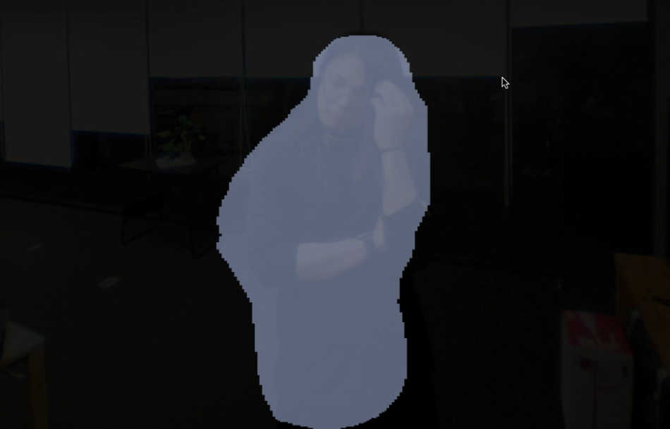

# opencvtest

### An environment to test OpenCV samples written in C++.

---

#### Coded by Yota Odaka ([@odkey](https://github.com/odkey/))

#### Latest updating: Jan 11 2019

---


## Getting start

#### Dependencies

- Build OpenCV framework from [here](https://github.com/opencv/opencv) (if you needs contribute algorithm, also check [here](https://github.com/opencv/opencv_contrib)) , and place a built framework (named "opencv2.framework") in `path/to/project/opencvtest/lib` .

#### Building sources

- Build sources in Xcode. There are some kinds of sample targets. You can choose one sample you like from scheme selector in Xcode, and build it. 
- Binary files will be output in the directory `path/to/project/executables`. This automation is depends on the script file `copy_apps_into_executables.sh`, so you shouldn't edit it.

#### Executing

- Binary files, which is output in `/executables` directory, can be executed using your Terminal app.  Arguments are necessary at almost all executables. Follow help message or OpenCV document.

---


## Environment

#### Already checked is...

- macOS 10.13.6 (High Sierra)
- Xcode 10.1
- Macbook Pro Early 2015, 13inch

---

## How to use executables

#### segmentation

- Before build binary file, download configuration file `fcn8s-heavy-pascal.prototxt` and learned model `fcn8s-heavy-pascal.caffemodel`. Then place them under `/opencvtest/assets/`.

  - [caffemodel](http://dl.caffe.berkeleyvision.org/fcn8s-heavy-pascal.caffemodel)
  - [prototxt](https://github.com/opencv/opencv_extra/blob/master/testdata/dnn/fcn8s-heavy-pascal.prototxt)

- Invoke this executable binary file with arguments in Terminal app to test semantic segmentation, like...

- ```script
  $ ./segmentation --model=fcn8s-heavy-pascal.caffemodel --mean=0 0 0 --rgb=0 --config=fcn8s-heavy-pascal.prototxt --width=500 --height=500 --input=xxx.jpg
  ```

  - `--input` can be empty, then camera will start to capture. You can specify camera with `--device` parameter. 
  - `--input` can also be video file format.
  - To use GPU, specify `--target`parameter.

- For example

  - 

---


## License

### The MIT License

Copyright 2019 Yota Odaka

Permission is hereby granted, free of charge, to any person obtaining a copy of this software and associated documentation files (the "Software"), to deal in the Software without restriction, including without limitation the rights to use, copy, modify, merge, publish, distribute, sublicense, and/or sell copies of the Software, and to permit persons to whom the Software is furnished to do so, subject to the following conditions:

The above copyright notice and this permission notice shall be included in all copies or substantial portions of the Software.

THE SOFTWARE IS PROVIDED "AS IS", WITHOUT WARRANTY OF ANY KIND, EXPRESS OR IMPLIED, INCLUDING BUT NOT LIMITED TO THE WARRANTIES OF MERCHANTABILITY, FITNESS FOR A PARTICULAR PURPOSE AND NONINFRINGEMENT. IN NO EVENT SHALL THE AUTHORS OR COPYRIGHT HOLDERS BE LIABLE FOR ANY CLAIM, DAMAGES OR OTHER LIABILITY, WHETHER IN AN ACTION OF CONTRACT, TORT OR OTHERWISE, ARISING FROM, OUT OF OR IN CONNECTION WITH THE SOFTWARE OR THE USE OR OTHER DEALINGS IN THE SOFTWARE.


